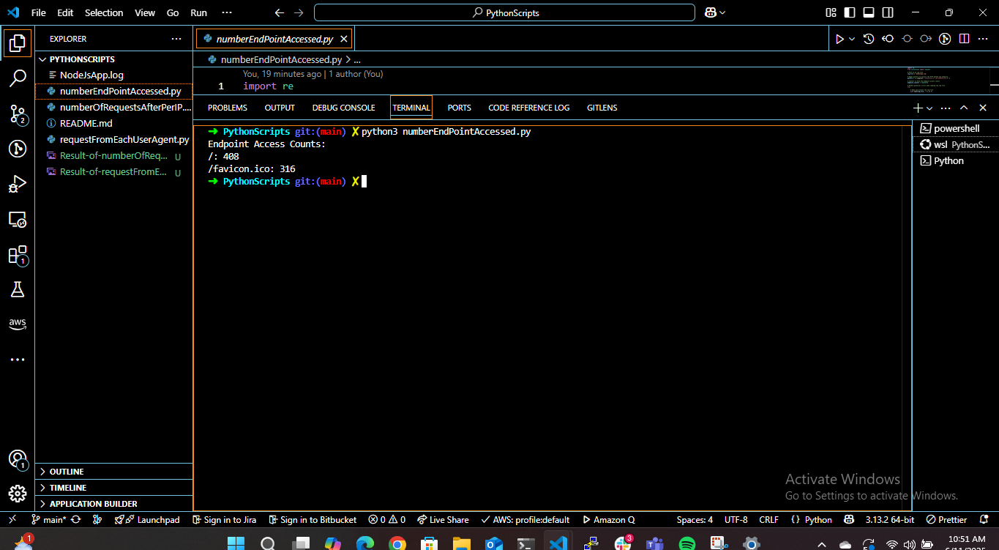
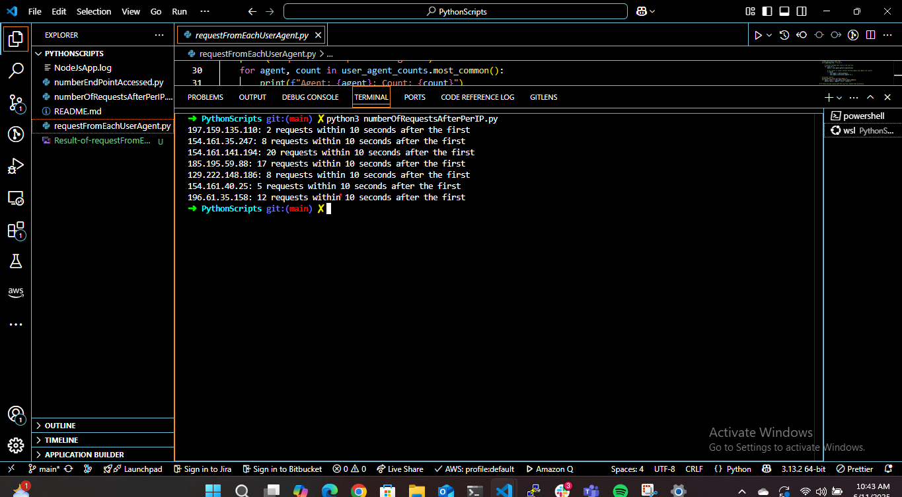
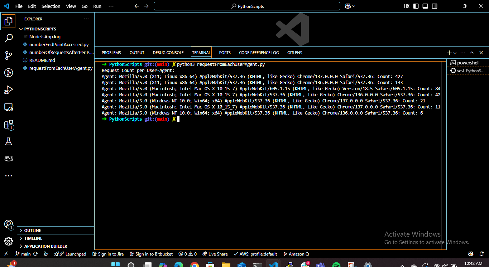

# Log Analysis Scripts for NodeJsApp

This repository contains Python scripts for analyzing server log data from a Node.js application beging monitored by AWS CloudWatch. The log file must be named `NodeJsApp.log` and placed in the same directory as the scripts.

## Scripts

### 1. numberEndPointAccessed.py

This script analyzes the `NodeJsApp.log` file and counts how many times each endpoint was accessed.

#### Features

- Extracts HTTP endpoints from log entries.
- Tallies the number of times each endpoint was accessed.
- Outputs a sorted list of endpoints by frequency.

#### Usage

```bash
python3 numberEndPointAccessed.py
```

#### Expected Output



### 2. numberOfRequestsAfterPerIP.py

This script examines request patterns per IP address and determines how many requests were made within **10 seconds after their first request**.

#### Features

- Extracts timestamps and IP addresses.
- Groups requests per IP.
- Counts the number of follow-up requests within 10 seconds from each IP's first request.

#### Usage

```bash
python3 numberOfRequestsAfterPerIP.py
```

#### Expected Output



### 3. requestFromEachUserAgent.py

This script analyzes the `NodeJsApp.log` file to count the number of requests from each unique User-Agent.

#### Features

- Extracts the User-Agent string from each log line.
- Counts how many requests each User-Agent made.
- Outputs the list sorted by frequency.

#### Usage

```bash
python3 requestFromEachUserAgent.py
```

#### Expected Output



## Setup Instructions

To use these scripts from GitHub, follow these steps:

### 1. Clone the Repository

```bash
git clone https://github.com/Zapwap123/Python-Scripts-To-Extract-Information-From-A-Log-File.git
cd Python-Scripts-To-Extract-Information-From-A-Log-File
```

### 2. Add the Log File

Make sure the `NodeJsApp.log` file is in the root directory of the cloned repository.

### 3. Run the Scripts

Use Python 3 to run any of the provided scripts:

```bash
python3 numberEndPointAccessed.py
python3 numberOfRequestsAfterPerIP.py
python3 requestFromEachUserAgent.py
```

## Dependencies

These scripts only use Python standard libraries:

- `re`
- `datetime`
- `collections`

---

## License

MIT License
